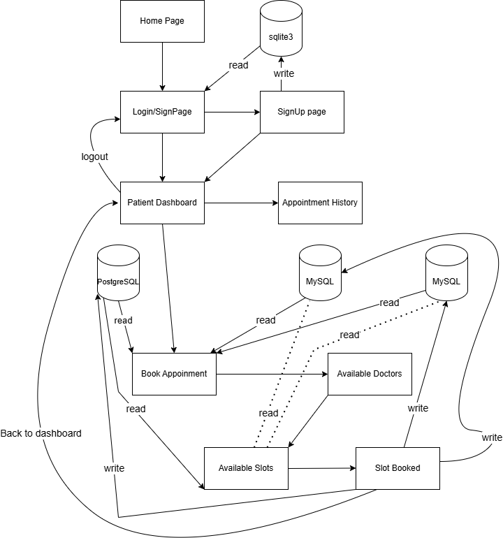

# 🏥 DocConnect – Unified Multi-Hospital Appointment Booking System

Welcome to **DocConnect**, a powerful Django-based web application that enables patients to book appointments across multiple hospitals seamlessly. Built to handle **heterogeneous schemas** across different database systems, DocConnect intelligently maps schemas using **semantic matching** and **string Matching Algorithms**.
Team: Prashant Shrotriya, Aditya Sahai, Nimish Goyal
## 📌 Features

### ✅ Patient-Centric Appointment Management
- User registration & login
- View available doctors by specialization
- Book & cancel appointments
- View upcoming, completed, and cancelled appointments

### 🧠 Intelligent Schema Matching
- Matches global schema with hospital-specific schemas using:
  - `token`, `fuzzy`, and `semantic` matching (using `Sentence-BERT`)
  - Automatic table name detection
  - Foreign key resolution

### 🔄 Multi-Database Integration
- 1 PostgreSQL (Render-hosted)
- 2 MySQL (TiDB Cloud-hosted)
- Schema-agnostic querying across hospitals: Search and retrieve appointment or doctor information seamlessly, regardless of differences in hospital database structures.
---

## 🏗️ Project Architecture

```text
📦 docconnect/
 ┣ 📂 appointments/
 ┣ 📁 docconnect 
 ┣ 📂 patients/
 ┣ 📂 templates/
 ┣ 📂 static/
 ┣ 📜 manage.py
 ┣ 📜 .env
 ┗ 📜 README.md

```
## flowchart


## ⚙️ Technologies Used

| Area | Tech Stack |
|------|------------|
| 🧠 NLP | sentence-transformers, difflib |
| 🎯 Backend | Django 5.1.2, Python 3.11 |
| 🗃 Databases | PostgreSQL, MySQL (TiDB Cloud) |
| 💻 Frontend | HTML, CSS, Bootstrap 5 |


## 🚀 Getting Started

### 1. Clone the Repository
```bash
git clone https://github.com/prashantshrotriyas/DocConnect.git
cd Docconnect
```

### 2. Set Up Virtual Environment
```bash
python -m venv venv
source venv/bin/activate 
pip install -r requirements.txt
```

### 3. Configure .env
Create a `.env` file in the project root directory and provide your database credentials.  
Before proceeding, ensure you have set up three databases: two on TiDB Cloud (MySQL-compatible) and one on Render (PostgreSQL).  
Update the `.env` file with the connection details for each database as required by your application's configuration.

### 4. Run Migrations
```bash
python manage.py migrate
```

### 5. Start the Development Server
```bash
python manage.py runserver
```

Visit http://127.0.0.1:8000 to access the app.

---

